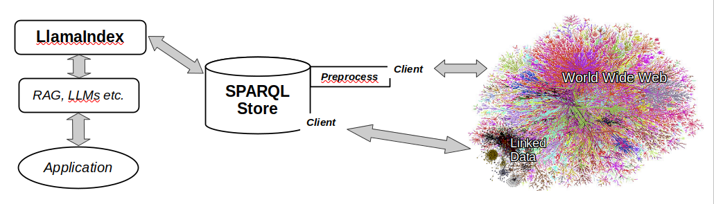

# SPARQL for LlamaIndex : The Goal

**TL;DR** : allow LLM-based systems to use information from the Web in a structured and efficent fashion.

## The Problem

## A Possible Solution

### LlamaIndex

> LlamaIndex is a data framework for LLM applications to ingest, structure, and access private or domain-specific data.

It includes :

- Data connectors
- Data indexes
- Engines provide natural language access to data
- Query engines
- Chat engines
- Data agents
- Application integrations

existing graph connectors, Graph RAG

### SPARQL

The [SPARQL Query Language for RDF](https://www.w3.org/TR/sparql11-overview/) is part of a raft of [W3C Recommendations](https://www.w3.org/TR/sparql11-overview/). It provides a means of interacting with RDF data.

#### RDF

The [Resource Description Framework](https://www.w3.org/TR/rdf11-primer/) provides a means of representing data that is inherently, by design, interoperable with the World Wide Web. Key to this is the use of URIs (especially URLs) to identify conceptual resouces and relations between them. It uses a graph model, which may be expressed as a series of _subject-property-object_ triples. (Typically _subject_ and _property_ are URI-identified resources, _object_ may be the same or a string literal). There are several different format specifications ([Turtle](http://www.w3.org/TR/2014/REC-turtle-20140225/) is the most human-readable). The RDF model is descriptive rather prescriptive, it doesn't have schemas in the traditional DB sense, though RDF Schemas provide a means of disambiguating descriptions. The formal semantics of RDF+RDFS are relatively lightweight, though additional inference can be layered on top, notably by [OWL](https://www.w3.org/TR/owl2-overview/), the Web Ontology language.

**TODO** ref KR, knowledgebases, concept maps etc. Graph of Thought paper; Linked Data

#### SPARQL Stores

SPARQL Stores act as graph databases, storing RDF as URI-named graphs. The SPARQL language uses queries comparable to other query languages (SELECT, INSERT etc).
The standard protocols are built on HTTP (GET, POST, PUT etc). There are numerous [store implementations](https://github.com/RDFLib/sparqlwrapper#sparql-endpoint-implementations), client tools & libraries.

### Implementation



TODO but I'd better put a placeholder

diagram needs tweaking.

**The main purpose of the SPARQL store is to act as a cache**

You ask about a URL, it may already have data in the store so doesn't need to go visiting. If the representation is a HTML doc online, then a tweak may be desirable (see below). But it can still be near-real-time.

There are plenty of SPARQL endpoints available, but the data available can be of arbitrary shapes. The [CONSTRUCT](https://www.w3.org/TR/2013/REC-sparql11-query-20130321/#construct) form of SPARQL queries should be very useful here. It can, pretty much arbitrarily, declaratively transform the shape of _this_ shape of graph data into _that_ shape of graph data. Recognition of relevant text data (literals) is totally doable, but as an intermediate step, for say Wikidata endpoints or whatever, a CONSTRUCT can be hardcoded to make the necessary flip.

**TODO** diagram of node-arc-node link between two pages

In a simple case, the preprocessing could be a crawler which does a HTTP GET on the document (at URL A), extract links (at B, C) and normalize the content to plain text, yielding RDF something like :

```
base : <http://example.org/a-site/>
prefix x: <http://example.org/whatever>

<A> a x:Document ;
    x:content "...text of the page..." ;
    x:related <B> ;
    x:related <C> .
```

Going one step further, a similarity measure could put a numeric value on how strongly related A and B are, A and C are, etc. There are plenty of low-cost algorithms that might be suitable. If processor cycles weren't an issue, an LLM could be used to discover _how_ A and B are related.

The [HTTP definition of resources and representations](https://www.rfc-editor.org/rfc/rfc9110.html#resources) is quite open ended, it effectively says a resource is anything that can be identified (with a URI) and a representation is some manifestation of the thing identified that can be transferred over HTTP. HTML documents are typical on the Web, but also images, audio files etc. follow the same pattern. The same crawler mechanism as above could be used to initially discover such media and then machine vision etc. used to determine relationships between them and other resources.

sites have small models encapsulating the information contained on their site, easily pluggable into anyone's local system by the addition of the link
